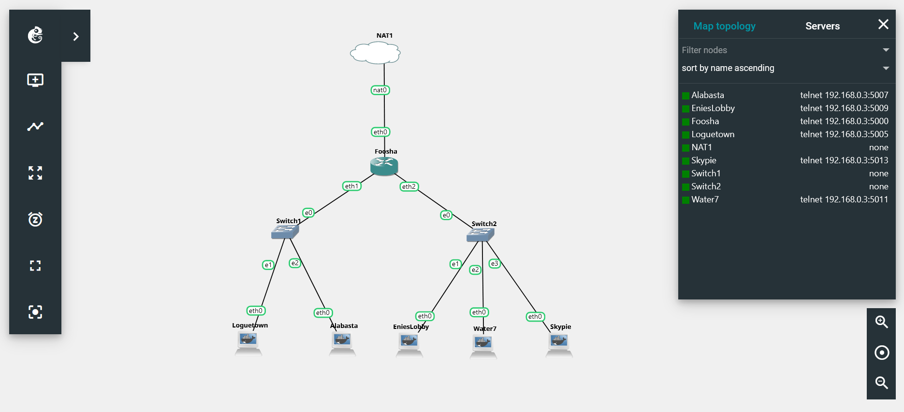

# Jarkom-Modul-2-D09-2021

Nama Anggota | NRP
------------------- | --------------		
Dias Tri Kurniasari | 05111940000035
Nazhwa Ameera H | 05111940000133
Nur Moh. Ihsanuddien | 05111940000142

## Pengaturan Awal 

### Pengaturan Topologi


### Edit Konfigurasi Network

#### Foosha (Router)
``` 
    auto eth0
    iface eth0 inet dhcp
    auto eth1
    iface eth1 inet static
        address 192.196.1.1
        netmask 255.255.255.0
    auto eth2
    iface eth2 inet static
        address 192.196.2.1
        netmask 255.255.255.0
```

#### EniesLobby (DNS Master)
```
    auto eth0
    iface eth0 inet static
        address 192.196.2.2
        netmask 255.255.255.0
        gateway 192.196.2.1
```

#### Water7 (DNS Slave)
```
    auto eth0
    iface eth0 inet static
        address 192.196.2.3
        netmask 255.255.255.0
        gateway 192.196.2.1
```

#### Skypie (Web Server)
```
    auto eth0
    iface eth0 inet static
        address 192.196.2.4
        netmask 255.255.255.0
        gateway 192.196.2.1
```

#### Loguetown (Client)
```
    auto eth0
    iface eth0 inet static
        address 192.196.1.2
        netmask 255.255.255.0
        gateway 192.196.1.1
```

#### Alabasta (Client)
```
auto eth0
iface eth0 inet static
	address 192.196.1.3
	netmask 255.255.255.0
	gateway 192.196.1.1
```

## No 1
EniesLobby akan dijadikan sebagai DNS Master, Water7 akan dijadikan DNS Slave, dan Skypie akan digunakan sebagai Web Server. Terdapat 2 Client yaitu Loguetown, dan Alabasta. Semua node terhubung pada router Foosha, sehingga dapat mengakses internet.


## No 2
Membuat website utama dengan mengakses franky.yyy.com dengan alias www.franky.yyy.com pada folder kaizoku


## No 3
Setelah itu buat subdomain super.franky.yyy.com dengan alias www.super.franky.yyy.com yang diatur DNS nya di EniesLobby dan mengarah ke Skypie.


## No 4
Buat juga reverse domain untuk domain utama


## No 5
Supaya tetap bisa menghubungi Franky jika server EniesLobby rusak, maka buat Water7 sebagai DNS Slave untuk domain utama


## No 6
Setelah itu terdapat subdomain mecha.franky.yyy.com dengan alias www.mecha.franky.yyy.com yang didelegasikan dari EniesLobby ke Water7 dengan IP menuju ke Skypie dalam folder sunnygo.


## No 7
Untuk memperlancar komunikasi Luffy dan rekannya, dibuatkan subdomain melalui Franky dengan nama general.mecha.franky.yyy.com dengan alias www.general.mecha.franky.yyy.com yang mengarah ke Skypie.

Pertama buka Water7, kemudian buka `/etc/bind/sunnygo/mecha.franky.d09.com` dan edit isinya seperti berikut.
```
    $TTL    604800
    @       IN      SOA     mecha.franky.d09.com. root.mecha.franky.d09.com. (
                                2         ; Serial
                            604800         ; Refresh
                            86400         ; Retry
                            2419200         ; Expire
                            604800 )       ; Negative Cache TTL
    ;
    @       IN      NS      mecha.franky.d07.com.
    @       IN      A       192.196.2.4 ;IP Skypie
    www     IN      CNAME   mecha.franky.d09.com.
    ns1     IN      A       192.196.2.4 ; IP Skypie
    general IN      NS      ns1
```
Setelah itu, menambahkan zone pada `/etc/bind/named.conf.local` sebagai berikut :
```
    zone "general.mecha.franky.d09.com" {
            type master;
            file "/etc/bind/sunnygo/general.mecha.franky.d09.com";
};
```
Lalu copy `/etc/bind/db.local` menjadi `/etc/bind/sunnygo/general.mecha.franky.d09.com`. Kemudian, lakukan konfigurasi file agar memiliki SOA `general.mecha.franky.d09.com.`, NS `general.mecha.franky.d09.com.`, record A yang mengarah ke `IP Skypie`, dan CNAME `www` pada `general.mecha.franky.d09.com.`.
Setelah itu, jalankan perintah `service bind9 restart` dan testing.


## No 8
Setelah melakukan konfigurasi server, maka dilakukan konfigurasi Webserver. Pertama dengan webserver www.franky.yyy.com. Pertama, luffy membutuhkan webserver dengan DocumentRoot pada /var/www/franky.yyy.com.

Pertama buka EnniesLoby, kemudian buka `/ect/bind/kaizoku/franky.d09.com` dan edit isinya seperti berikut.
```
    $TTL    604800
    @       IN      SOA     franky.d09.com. root.franky.d09.com. (
                                2         ; Serial
                            604800         ; Refresh
                            86400         ; Retry
                            2419200         ; Expire
                            604800 )       ; Negative Cache TTL
    ;
    @       IN      NS      franky.d09.com.
    @       IN      A       192.196.2.4 ; IP Skypie 
    ns2     IN      A       192.196.2.3 ; IP Water7
    mecha   IN      NS      ns2
```
Kemudian jalankan perintah `service bind9 restart`.

Selanjutnya, buka logueTown untuk install `lynx`.

Lalu, buka Skypie. Pertama install `apache2`, `php`, dan `libapache2-mod-php7.0`. Kemudian melakukan `wget` untuk mendownload file yang diperlukan. Setelah itu lakukan unzip.
```
    apt-get install wget
    wget https://github.com/FeinardSlim/Praktikum-Modul-2-Jarkom/archive/refs/heads/main.zip
    apt-get install unzip
    unzip main.zip
    cd Praktikum-Modul-2-Jarkom-main
    unzip franky.zip
    unzip super.franky.zip
    unzip general.mecha.franky.zip
```
Setelah itu, pindah ke `/etc/apache2/sites-available`.Lalu, copy file `000-default.conf` menjadi file `franky.d09.com.conf`. Kemudian buka file tersebut dan tambahkan sebagai berikut :
```
    ServerAdmin webmaster@localhost
    ServerName franky.d09.com
    ServerAlias www.franky.d09.com
    DocumentRoot /var/www/franky.d09.com
```
Kemudian buat directory baru dengan nama `franky.d09.com` pada `/var/www/` menggunakan command `mkdir /var/www/franky.d09.com`. Setelah itu, copy isi dari folder `franky` yang telah didownload ke `/var/www/franky.d09.com`.
```
    cp /root/Praktikum-Modul-2-Jarkom-main/franky/index.php /var/www/franky.d09.com
    cp /root/Praktikum-Modul-2-Jarkom-main/franky/home.html /var/www/franky.d09.com
```
Kemudian jalankan perintah `a2ensite franky.d09.com ` dan `service apache2 restart`.


## No 9
Setelah itu, Luffy juga membutuhkan agar url www.franky.yyy.com/index.php/home dapat menjadi menjadi www.franky.yyy.com/home.

Pertama buka Skypie, kemudian jalankan perintah `a2enmod rewrite` dan `service apache2 restart`.
Setelah itu pindah ke `/var/www/franky.d09.com` dan buat file `.htaccess` dengan isi sebagai berikut :
```
    RewriteEngine On
    RewriteRule ^home$ index.php/home
```
Setelah itu, buka file `/etc/apache2/sites-available/franky.d09.com.conf` dan tambahkan seperti berikut :
```
    <Directory /var/www/franky.d09.com>
        Options +FollowSymLinks -Multiviews
        AllowOverride All
    </Directory>
```
Setelah itu, jalankan perintah `service bind9 restart` dan testing.


## No 10
Setelah itu, pada subdomain www.super.franky.yyy.com, Luffy membutuhkan penyimpanan aset yang memiliki DocumentRoot pada /var/www/super.franky.yyy.com

Pertama buka Skypie, kemudian pindah ke `/etc/apache2/sites-available`. Lalu copy file `000-default.conf` menjadi file `super.franky.d09.com.conf`. Setelah itu, buka file tersebut dan tambahkan isinya sebagai berikut :
```
    ServerAdmin webmaster@localhost
    #DocumentRoot /var/www/html
    ServerName super.franky.d09.com
    ServerAlias www.super.franky.d09.com
    DocumentRoot /var/www/super.franky.d09.com
```
Kemudian buat directory baru dengan nama `super.franky.d09.com` pada `/var/www/` menggunakan command `mkdir /var/www/super.franky.d09.com`. Setelah itu, copy isi dari folder `super.franky` yang telah didownload ke `/var/www/super.franky.d09.com`.
```
    cp -r /root/Praktikum-Modul-2-Jarkom-main/super.franky/error /var/www/super.franky.d09.com
    cp -r /root/Praktikum-Modul-2-Jarkom-main/super.franky/public /var/www/super.franky.d09.com
```
Kemudian jalankan perintah `a2ensite super.franky.d09.com ` dan `service apache2 restart`.


## No 11
Akan tetapi, pada folder /public, Luffy ingin hanya dapat melakukan directory listing saja.

Pertama buka Skypie, kemudian pindah ke `/etc/apache2/sites-available` lalu buka file `super.franky.d09.com.conf` dan tambahkan isinya sebagai berikut :
```
    <Directory /var/www/super.franky.d09.com/public>
        Options +Indexes
    </Directory>
```
Setelah itu, jalankan perintah `service bind9 restart` dan testing.


## No 12
Tidak hanya itu, Luffy juga menyiapkan error file 404.html pada folder /errors untuk mengganti error kode pada apache.

Pertama buka Skypie, kemudian pindah ke `/etc/apache2/sites-available` lalu buka file `super.franky.d09.com.conf` dan tambahkan isinya dengan `ErrorDocument 404 /error/404.html`.


## No 13
Luffy juga meminta Nami untuk dibuatkan konfigurasi virtual host. Virtual host ini bertujuan untuk dapat mengakses file asset www.super.franky.yyy.com/public/js menjadi www.super.franky.yyy.com/js.
Pertama buka Skypie, kemudian pindah ke `/etc/apache2/sites-available` lalu buka file `super.franky.d09.com.conf` dan tambahkan isinya dengan `Alias "/js" "/var/www/super.franky.d09.com/public/js"`


## No 14
Dan Luffy meminta untuk web www.general.mecha.franky.yyy.com hanya bisa diakses dengan port 15000 dan port 15500.

Pertama buka Skypie, kemudian pindah ke `/etc/apache2/sites-available`. Lalu copy file `000-default.conf` menjadi file `general.mecha.franky.d09.com.conf`. Setelah itu, buka file tersebut dan tambahkan isinya sebagai berikut :
```
    <VirtualHost *:15000 *:15500>
    # The ServerName directive sets the request scheme, hostname and port thh
    at
    # the server uses to identify itself. This is used when creating
    # redirection URLs. In the context of virtual hosts, the ServerName
    # specifies what hostname must appear in the request's Host: header to
    # match this virtual host. For the default virtual host (this file) this
    # value is not decisive as it is used as a last resort host regardless.
    # However, you must set it for any further virtual host explicitly.
    #ServerName www.example.com

    ServerAdmin webmaster@localhost
    #DocumentRoot /var/www/html
    ServerName general.mecha.franky.d09.com
    ServerAlias www.general.mecha.franky.d09.com
    DocumentRoot /var/www/general.mecha.franky.d09.com
```
Kemudian buka `/etc/apache2/ports.conf` dan tambahkan 
```
    Listen 15000
    Listen 15500
```
Kemudian buat directory baru dengan nama `general.mecha.franky.d09.com` pada `/var/www/` menggunakan command `mkdir /var/www/general.mecha.franky.d09.com`. Setelah itu, copy isi dari folder `general.mecha.franky` yang telah didownload ke `/var/www/general.mecha.franky.d09.com`.
```
    cp /root/Praktikum-Modul-2-Jarkom-main/general.mecha.franky/* /var/www/general.mecha.franky.d09.com
```
Kemudian jalankan perintah `a2ensite general.mecha.franky.d09.com` dan `service apache2 restart`.


## No 15
Dengan authentikasi username luffy dan password onepiece dan file di /var/www/general.mecha.franky.yyy

Pertama buka Skypie, kemudian jalankan perintah `htpasswd -c /etc/apache2/.htpasswd luffy` untuk membuat file yang menyimpan username dan password kedalam file `/etc/apache2/.htpasswd` dengan user `luffy`, lalu akan ada prompt untuk memasukkan dan mengkonfirmasi password. Passwordnya `onepiece`

Kemudian, buka file `/etc/apache2/sites-available/general.mecha.franky.d09.com.conf` dan edit isinya menjadi :
```
    <Directory /var/www/general.mecha.franky.d09.com>
    Options +FollowSymLinks -Multiviews
    AllowOverride All
    </Directory>
```
Setelah itu, buka file `/var/www/general.mecha.franky.d09.com/.htaccess` dan edit menambahkan :
```
    AuthType Basic
    AuthName "Restricted Content"
    AuthUserFile /etc/apache2/.htpasswd
    Require valid-user
```
Kemudian, jalankan perintah `service apache2 restart`.


## No 16
Dan setiap kali mengakses IP EniesLobby akan diahlikan secara otomatis ke www.franky.yyy.com

Pertama buka Skypie, kemudian pindah ke `/var/www/html` dan edit file `.htaccess` menjadi :
```
    RewriteEngine On
    RewriteBase /~new/
    RewriteCond %{HTTP_HOST} ^192\.195\.2\.4$
    RewriteRule ^(.*)$ franky.d07.com [L,R=301]
```
Lalu buka file `/etc/apache2/sites-available/000-default.conf` dan edit isinya menjadi :
```
    <Directory /var/www/html>
    Options +FollowSymLinks -Multiviews
    AllowOverride All
    </Directory>
```
Kemudian, jalankan perintah `service apache2 restart`.


## No 17
Dikarenakan Franky juga ingin mengajak temannya untuk dapat menghubunginya melalui website www.super.franky.yyy.com, dan dikarenakan pengunjung web server pasti akan bingung dengan randomnya images yang ada, maka Franky juga meminta untuk mengganti request gambar yang memiliki substring “franky” akan diarahkan menuju franky.png.

Pertama buka Skypie, kemudian edit file `/etc/apache2/sites-available/super.franky.d09.com.conf` dengan menambahkan :
```
<Directory /var/www/super.franky.d09.com>
                Options +FollowSymLinks -Multiviews
                AllowOverride All
        </Directory>
```
Setelah itu, buka `/var/www/super.franky.d09.com/.htaccess` dan tambahkan :
```
    RewriteEngine ON
    RewriteRule ^(.*)franky(.*)$ http://super.franky.d07.com/public/images/franky.pnn
    g [L,R]
```


## Error dan Kendala